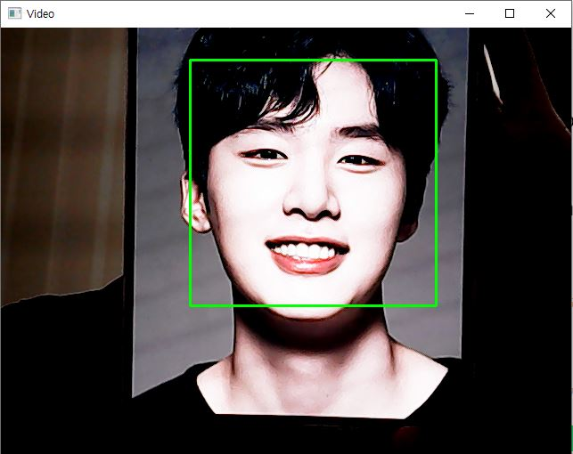
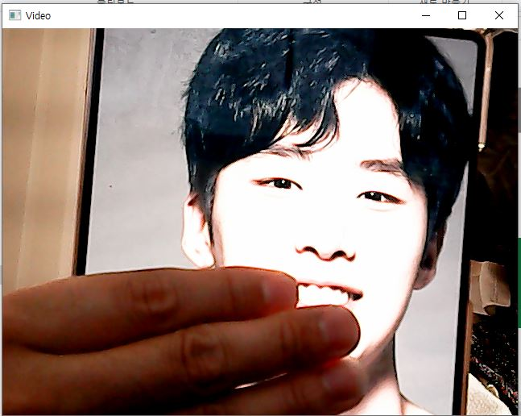

# OpenCV-miniProject-FaceDetection
## Webcam Face Recognition Program

웹캠 얼굴 인식  **python**.

## 요구 사항:
1. OpenCV 설치
2. 웹캠-
3. Python 및 cascades 대한 지식

## Cascades:
캐스케이드 분류기는 object Detection이 가능한 opencv의 api  
초기에는 얼굴 인식을 위한 목적이엿으나 최근에는 다양한 형태의 물체 인식도 가능  
https://github.com/opencv/opencv/tree/4.x/data/haarcascades 이링크에 훈련되 데이터 있음  
소스코드에도 data 폴더란에 옮겨놓음

## Run the program:

*python webcam_cv2.py*

## Note:

~~~~

webcom_cv2.py 를 실행, 바깥에는 얼굴인식 눈인식 등 훈련데이터를 넣어놓음
일반적으로 alt2가 인식률이 좋다함 ..... 눈은 잘....

~~~~

## 테스트 결과:
김동희 배우님 감사합니다....
### Successful Test

### Test case 2

## Upcoming Push:

나중에 미니프로젝트로 얼굴인식 진행해보기,,

